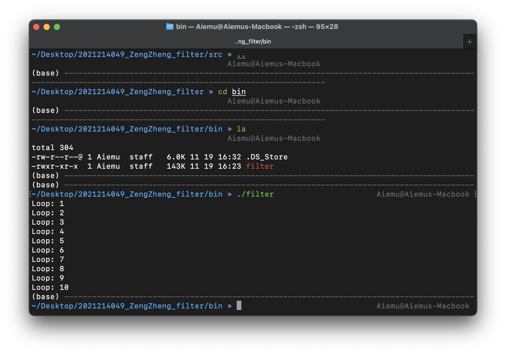

# imgFilter

## Overview
Use C++ to implement LOMO and Crystallization filters. The structure of the project and its description are as follows:
- `bin`: store executable files
- `src`: store source code
- `config.txt`: configuration file of the filter program
- `data`: some input samples
- `output`: results of the filter

## Usage
### Test Environment and Dependent Library
- `C++ 14`
- `cmake 3.21.4`
- `opencv: stable 4.5.3 (bottled)`
- `gcc/g++`: Apple clang version 13.0.0
- OS: macOS Monterey, 12.0.1
- IDE: CLion 2021.2.3

### Quick Start
You can test the effect of the filters by directly clicking on the executable file (`bin/filter`) and running the source code (`src/`). Specific steps are as follows.

#### From `bin/`
Please note that the executable file in `bin/` is compiled and generated on macOS, so it cannot be used on other platforms. Please try to compile the executable file of the corresponding OS from the source code in `src/`.

In order to run the executable file, first open the `Terminal` and switch the path to the bin directory (with command `cd`), then execute the following command to run the program: 
``` bash
./filter
```
Then the program will run in the figure below. Where loop N is the number of iterations of the crystallization filter, there are ten times in total here. The results will be displayed during execution and will be saved in `output\`.


#### From `src/`
In order to compile and generate executable files, execute the following commands in `src`. If you have not installed opencv and ffmpeg, please install them first (you can try the command `brew install opencv ffmpeg` on macOS):
```
cmake .
make
```
Next, please follow the steps in [From `bin/`](#from-bin) to run the program.

#### Configuration
I added the configuration file `config.txt` to change the input image and some parameters of the crystallization filter. Its format is ass follow: 
```
filename=../data/lenna.png
M=15
cluster=1600
```
- `filename`: the path of the input image
- `M`: the parameters of the crystallization filter. The larger the M, the more obvious the crystallization effect
- `cluster`: the parameters of the crystallization filter. The larger the cluster, the greater the number of lattices, and the more details will be retained.

## Filter Implement
### LOMO
The implementation of the LOMO filter consists of the following two steps:
- Use function $(1+e^{\frac{0.5 - x}{s}})^{-1}$ to adjust the red channel of the image to make the image contrast more intense.
- Add a dark halo to simulate the camera shooting effect.

Some results are as follows. The left one is result after adjusting the red channel and the right one is the final result:


### Crystallization
Use SLIC algorithm to achieve. Mainly includes the following steps:
- Initialize the image segmentation block and the cluster center of the block.
- Calculate the distance between each pixel and the cluster center.
- Re-clustering.
  
There are 10 iterations in my algorithm, you can modify the number of times by modifying the `main.cpp` file.

Some results are as follows. The left one is the cluster result and the right one is the final result (`cluster = 1600`, `M = 15`):

